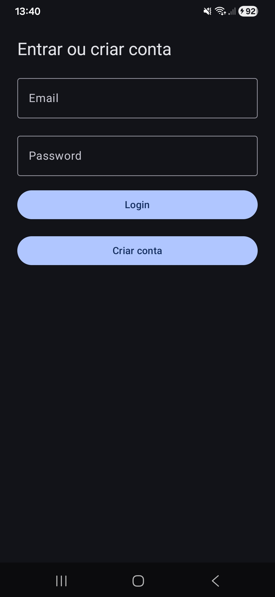
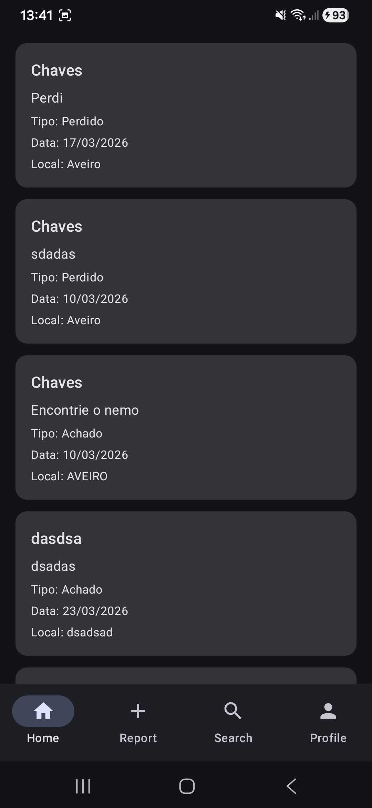
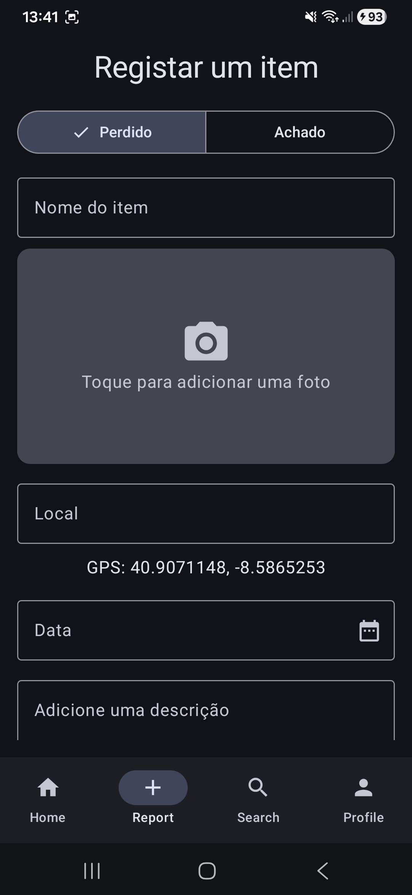
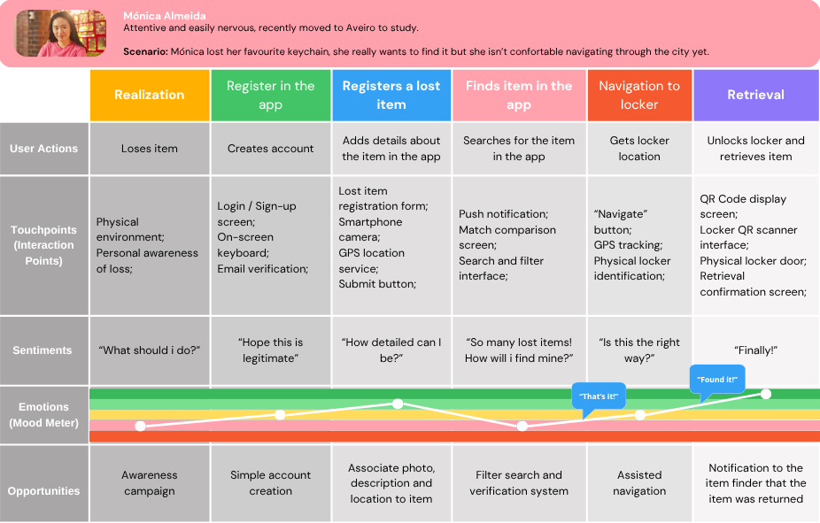
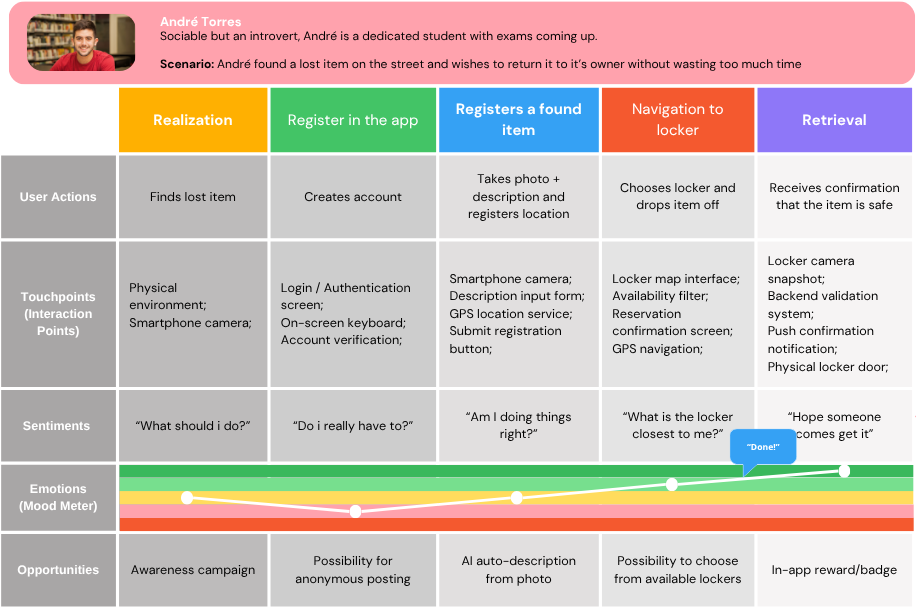
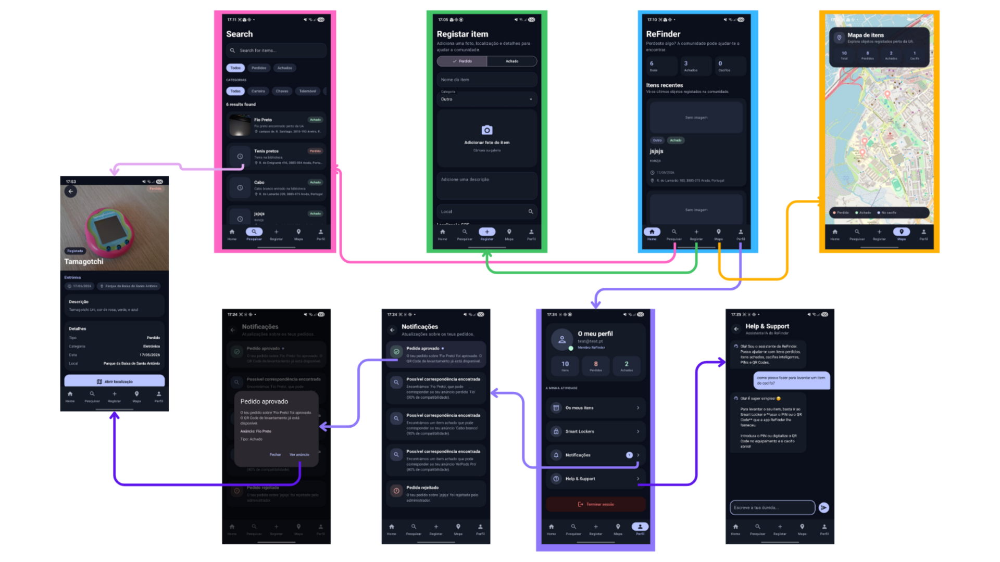
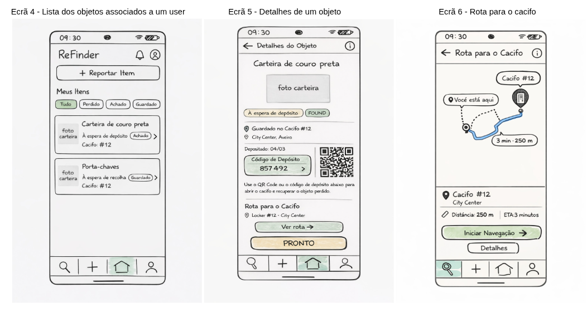

# ReFinder
**Aplicação inteligente de perdidos e achados.**


O **ReFinder** é uma aplicação Android desenvolvida em Kotlin com Jetpack Compose para simplificar e modernizar o processo de devolução de objetos perdidos. Através da integração de cacifos inteligentes (*smart lockers*), a app liga quem perdeu um objeto a quem o encontrou, garantindo uma devolução segura, rápida e eficiente.

Projeto desenvolvido no âmbito da disciplina de Introdução à Computação Móvel da Universidade de Aveiro.

---

## Capturas de Ecrã

| Ecrã de Login | Feed Principal | Registar Item |
|:---:|:---:|:---:|
|  |  |  |


---

## Funcionalidades Principais

* **Registo de Objetos:** Reporta facilmente itens perdidos ou encontrados com título, descrição, fotografias e data.
* **Localização Automática:** Captura das coordenadas GPS exatas no momento do registo do item.
* **Smart Lockers:** Possibilidade de depositar o objeto achado num cacifo dedicado, utilizando *QR Codes* para o dono o desbloquear de forma segura.
* **Pesquisa Inteligente:** Filtros avançados por tamanho, cor e localização para encontrares rapidamente o que procuras.
* **Navegação Assistida:** Encaminhamento GPS direto até ao cacifo onde o item está guardado.
* **Autenticação Segura:** Sistema de registo, login e logout (Email/Password) para garantir fiabilidade e um histórico pessoal.

---

## Experiência de Utilizador e Personas

Para garantir que a aplicação resolve problemas reais de forma intuitiva, baseámos o design e o fluxo de navegação em **Customer Journey Maps**. Criámos duas *personas* que representam os nossos utilizadores principais: quem perde (Mónica) e quem encontra (André).

### A Perspetiva de quem perde: Mónica
> *A Mónica é uma estudante recém-chegada a Aveiro que perdeu o seu porta-chaves favorito enquanto explorava a cidade.*

**O que aprendemos com a Mónica:** Como representa um utilizador mais ansioso, a sua jornada evidenciou a necessidade de **filtros de pesquisa precisos**, **navegação assistida** clara e a adição de **ecrãs de confirmação**. Isto ajuda a transmitir segurança durante a utilização da app.



### A Perspetiva de quem encontra: André
> *O André é um estudante em época de exames, que encontrou um porta-chaves no chão e quer devolvê-lo rapidamente.*

**O que aprendemos com o André:** Como utilizador apressado, ajudou-nos a focar na **agilização de todo o processo**. Daqui nasceram ideias como **gerar descrições automáticas** para o objeto e o destaque no mapa para os cacifos mais próximos, permitindo um depósito imediato.



---

## Fluxo de Ecrãs (UI/UX)

O fluxo de navegação foi desenhado para ser fluido e acessível com o menor número de cliques possível:




---

## Tecnologias e Arquitetura

* **Linguagem:** Kotlin
* **UI:** Jetpack Compose
* **Arquitetura:** MVVM (Model-View-ViewModel)
* **Backend:** Firebase (Authentication & Cloud Firestore)
* **Sensores & Serviços:** Google Play Services (`FusedLocationProviderClient`)

### Estrutura do Projeto
```text
pt.ua.icm.refinder
│
├── data/
│   ├── model/          # Data classes (ex: LostItem)
│   └── repository/     # Lógica de comunicação com o Firebase
│
├── ui/
│   ├── screens/        # Ecrãs (Home, Report, Profile, Search)
│   ├── components/     # Componentes visuais reutilizáveis
│   ├── theme/
│   └── navigation/     # Configuração das rotas
│
└── MainActivity.kt
```

---

## Base de Dados (Firestore)

A aplicação guarda a informação na coleção `items`. Cada item fica permanentemente associado ao `userId` de quem o registou. Exemplo de um documento real:

```json
{
  "id": "abc123def456",
  "title": "Chaves",
  "description": "Encontrei o nemo",
  "type": "found",
  "locationName": "AVEIRO",
  "latitude": 40.6421,
  "longitude": -8.6534,
  "tags":[],
  "date": "10/03/2026",
  "userId": "uid_do_utilizador",
  "createdAt": 177945405156
}
```

---
## Autores

- **Rodrigo Costa** - [GitHub](https://github.com/rodrigosc8)
- **Carolina Teixeira** - [GitHub](https://github.com/LinaTeixeira)
